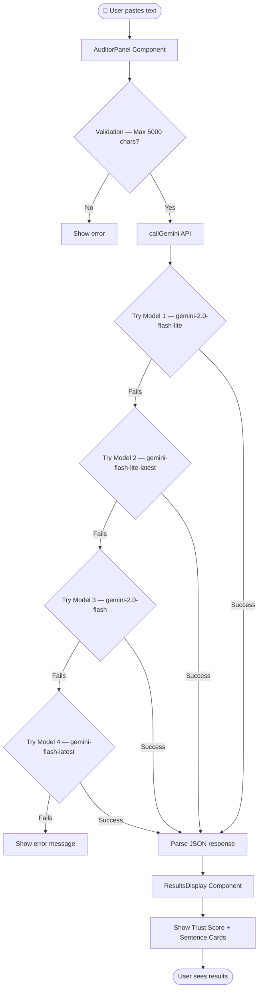
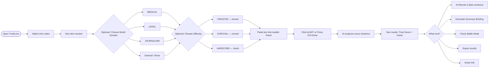
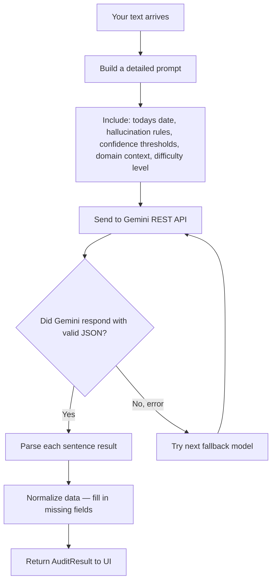

# ⛏️ TruthLens — AI Hallucination Auditor

> A Minecraft-themed web application that uses Google's Gemini AI to detect hallucinations (false or misleading claims) in any text you paste in. Built at **AceHack 5.0**.

---

## 🌍 What Is TruthLens?

When AI models like ChatGPT or Gemini generate text, they sometimes "hallucinate" — they confidently state things that are completely made up, cite fake sources, or twist real facts. TruthLens helps you **catch those lies**.

You paste in any text (an AI response, a news article, a research summary). TruthLens sends it to Google Gemini, which audits every sentence and tells you:

- ✅ Is this sentence **true**?
- ❌ Is it **false**?
- ⚠️ Is it **uncertain**?
- ⏰ Is it **too recent** for AI to verify?

The results appear in a beautiful Minecraft-style UI with animated blocks, character sprites, and 8-bit sound effects.

---

## ✨ Features at a Glance

| Feature | What It Does |
|---|---|
| **Sentence Audit** | Every sentence in your text is individually scored as TRUE / FALSE / UNCERTAIN |
| **Trust Score** | An overall % score for the whole text (like a health bar) |
| **Hallucination Types** | Each false claim is tagged — fabricated fact, fake source, wrong connection, etc. |
| **AI Rewrite** | Click a button to get a corrected version of any false sentence |
| **Claim Summary Briefing** | AI writes a short plain-English summary of what went wrong |
| **Battle Mode** | Pit two texts against each other — which one is more trustworthy? |
| **World Domains** | Medical / Legal / Journalism modes — stricter, domain-specific checks |
| **Difficulty Modes** | Creative (lenient) / Survival (normal) / Hardcore (brutal) |
| **Audit History** | Last 8 audits saved to your browser |
| **Share Link** | Copy a URL that encodes your results for sharing |
| **Export** | Download results as JSON or plain text |

---

## 🗺️ How It Works — Big Picture



*TruthLens tries up to 4 Gemini models automatically. If one is rate-limited or unavailable, it falls back to the next one.*

---

## 📁 Project Structure

```
TruthLens/
├── public/               ← Static assets (images, video)
│   ├── intro.mp4         ← Opening cinematic
│   ├── mc-grass.png      ← Minecraft block textures
│   └── mc-char2.png      ← Character sprites
├── src/
│   ├── main.tsx          ← Entry point (renders App)
│   ├── App.tsx           ← Root component — holds all state
│   ├── index.css         ← All CSS styles (Minecraft design system)
│   ├── components/       ← UI building blocks
│   │   ├── Hero.tsx          ← Landing hero section with 3D canvas
│   │   ├── HeroCanvas.tsx    ← Three.js 3D voxel background
│   │   ├── Navbar.tsx        ← Top navigation bar
│   │   ├── AuditorPanel.tsx  ← Main text input + audit button
│   │   ├── ResultsDisplay.tsx← Shows audit results, cards, scores
│   │   ├── TypesPanel.tsx    ← Block classification legend
│   │   ├── BattleMode.tsx    ← Head-to-head text comparison
│   │   ├── DomainSelector.tsx← Medical / Legal / Journalism picker
│   │   ├── UseCases.tsx      ← Sample text examples
│   │   ├── AuditHistory.tsx  ← Past audits stored in browser
│   │   ├── Footer.tsx        ← Page footer
│   │   ├── ScrollIntro.tsx   ← Scroll-reveal intro animation
│   │   ├── VideoIntro.tsx    ← Full-screen intro video
│   │   ├── CursorGlow.tsx    ← Glowing cursor effect
│   │   └── ComingSoon.tsx    ← Newsletter signup
│   └── lib/              ← Logic, data, utilities
│       ├── gemini.ts         ← All Gemini API calls
│       ├── types.ts          ← TypeScript type definitions
│       ├── audio.ts          ← 8-bit sound effects (Web Audio API)
│       ├── context.tsx       ← React Context providers
│       └── history.ts        ← Audit history (localStorage)
├── .env                  ← Your secret API key (never commit this!)
├── package.json          ← Dependencies list
├── vite.config.ts        ← Build configuration
└── netlify.toml          ← Deployment configuration
```

---

## 🔄 User Flow — Step by Step



---

## ⚙️ Setup — For Beginners

### Step 1 — Make sure Node.js is installed

1. Go to https://nodejs.org
2. Download and install the **LTS** (recommended) version
3. Open a terminal and type `node --version` — you should see a number like `v18.17.0`

### Step 2 — Get the project files

If you downloaded a zip file:
1. Extract the zip somewhere on your computer
2. Open a terminal and `cd` into the folder:
   ```
   cd path/to/TruthLens
   ```

### Step 3 — Set up your Gemini API key

TruthLens needs a Google Gemini API key to work.

1. Go to https://aistudio.google.com and create a free API key
2. In the TruthLens folder, create a file called `.env`
3. Add this line to it:
   ```
   VITE_GEMINI_API_KEY=your_api_key_here
   ```
4. Save the file

> ⚠️ **Never share your `.env` file or commit it to GitHub.** The `.gitignore` file already protects it.

### Step 4 — Install dependencies

In your terminal (inside the TruthLens folder):
```bash
npm install
```
This downloads all the libraries the project needs. It may take a minute.

### Step 5 — Start the development server

```bash
npm run dev
```
Open your browser and go to **http://localhost:5173** — TruthLens should be running!

---

## 🧠 How the Gemini Integration Works

The file `src/lib/gemini.ts` is the brain of TruthLens. Here's what it does in plain English:



### What Gemini is asked to do

The prompt tells Gemini:
- "Today's date is [DATE]. Do not flag recent events as future."
- Analyse every sentence individually
- For each sentence return: `status` (TRUE/FALSE/UNCERTAIN), `confidence` (0–100), `hallucination_type`, `reason`, and a `source_url` if available
- Return the result as strict JSON

### The 4 API Models (Fallback Chain)

| Priority | Model | Why |
|---|---|---|
| 1st | `gemini-2.0-flash-lite` | Fastest and cheapest |
| 2nd | `gemini-flash-lite-latest` | Alias fallback |
| 3rd | `gemini-2.0-flash` | More powerful |
| 4th | `gemini-flash-latest` | Last resort |

---

## 🌍 World Domains Explained

Choosing a domain injects extra expert rules into the Gemini prompt.

| Domain | What changes |
|---|---|
| 🏥 **MEDICAL** | Extra scrutiny on drug names, dosages, clinical trial claims, medical advice |
| ⚖️ **LEGAL** | Checks for misquoted laws, fake case citations, jurisdiction errors |
| 📰 **JOURNALISM** | Verifies attribution, checks for editorial bias, unnamed sources flagged |
| *(None)* | General-purpose audit — good for AI responses, essays, etc. |

---

## 🎮 Difficulty Modes Explained

| Mode | Description |
|---|---|
| 🎨 **CREATIVE** | Lenient. Only flags severely wrong claims. Good for creative writing. |
| ⚔️ **SURVIVAL** | Balanced. Standard fact-checking. Best for most use cases. |
| 💀 **HARDCORE** | No mercy. Flags anything even slightly uncertain. Maximum scrutiny. |

---

## 🧱 Hallucination Types

| Block | Type | What it means |
|---|---|---|
| 🪨 | **FABRICATED FACT** | Completely made up — never happened, doesn't exist |
| 🔗 | **FALSE SOURCE** | Fake URL or citation — looks real but leads nowhere |
| ⛓️ | **FALSE CONNECTION** | Real facts joined together wrongly |
| 📜 | **CONTEXT DISTORTION** | True fact applied to the wrong situation |
| ⏰ | **KNOWLEDGE GAP** | Claim is too recent — AI can't verify it yet |

---

## 🏗️ Tech Stack

| Technology | Role |
|---|---|
| **React 18** | UI framework — builds all the components |
| **TypeScript** | Adds types to JavaScript — catches bugs early |
| **Vite** | Super-fast build tool and dev server |
| **Three.js** | 3D voxel background in the hero section |
| **Tailwind CSS** | Utility-first CSS classes |
| **Google Gemini API** | The AI that actually reads and audits text |
| **Press Start 2P font** | The Minecraft-style pixel font |
| **Web Audio API** | 8-bit sound effects (built into the browser — no library needed) |

---

## 🚀 Deploying to Netlify

### Option A — Netlify Web UI (easiest)

1. Run `npm run build` — this creates a `dist/` folder
2. Go to https://netlify.com and sign up for free
3. Drag and drop the `dist/` folder onto the Netlify dashboard
4. In **Site settings → Environment variables**, add:
   - Key: `VITE_GEMINI_API_KEY`
   - Value: your Gemini API key
5. Done! You get a live URL like `https://truthlens-abc123.netlify.app`

### Option B — Netlify CLI

```bash
npm install -g netlify-cli   # Install CLI tool
npm run build                # Build the project
netlify login                # Log in to your Netlify account
netlify deploy --prod --dir=dist
```

> The `netlify.toml` file is already set up to handle routing correctly.

---

## 🔑 Environment Variables

| Variable | Required | Description |
|---|---|---|
| `VITE_GEMINI_API_KEY` | ✅ Yes | Your Google Gemini API key from https://aistudio.google.com |

---

## 📝 Scripts

| Command | Description |
|---|---|
| `npm run dev` | Start local development server |
| `npm run build` | Build for production (outputs to `dist/`) |
| `npm run preview` | Preview the production build locally |
| `npm run lint` | Run ESLint checks |

---

## 🤝 Credits

Built at **AceHack 5.0**.

- AI: Google Gemini
- Design inspiration: Minecraft / Mojang
- Fonts: Google Fonts (Press Start 2P)
